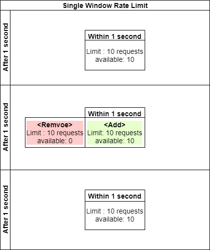
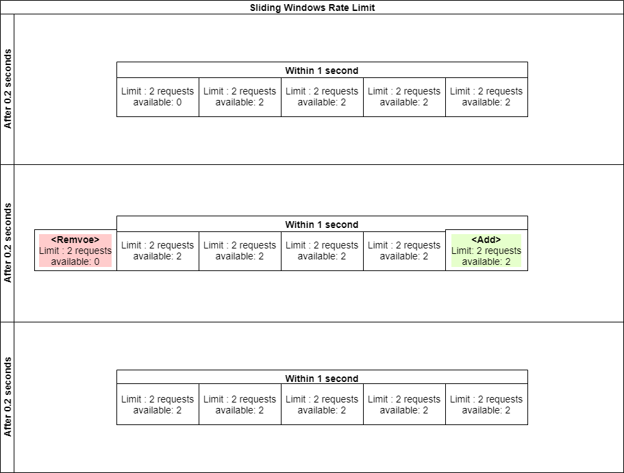
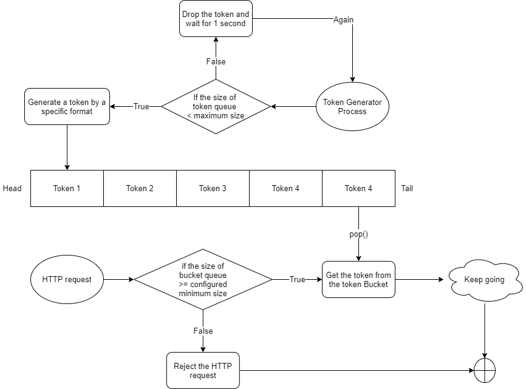

# rate-limit-algorithms
<!-- wp:paragraph -->

In the development of the high availability system, we usually protect the system by different kinds of ways, such as Cache, Rate Limit, and Downgrade. And this topic will be talking about the Rate Limit. The purpose of the Rate Limit is to prevent the system not to be destroyed by large amounts of requests to the system in a short period.

<!-- /wp:paragraph -->

<!-- wp:paragraph -->

The most common Rate Limit Algorithms are:

<!-- /wp:paragraph -->

<!-- wp:list {"ordered":true} -->
<ol><li>Fixed-windows counter Algorithm</li><li>Sliding windows counter Algorithm</li><li>Token Bucket Algorithm</li></ol>
<!-- /wp:list -->

<H3> <b>Fixed-Windows Counter Algorithm</b> </H3>

<!-- wp:paragraph -->

The simplest Rate Limit implementation is to maintain a counter and check the total number of requests within a time slot. The system will reject all HTTP requests when the counter is greater than the total number of HTTP requests in the timeslot until the next timeslot starts (the Counter will initialize to ZERO at the same time).
The disadvantage of the Fixed-Windows Counter Algorithm is the maximum requests can probably be higher than the threshold.
Assume the threshold for maximum requests is 10 per second, but what if ten requests send in the last few milliseconds within a second? We will probably have a total of 20 HTTP requests per 1 second if there are other ten HTTP requests sent to the server after 1 second. How could we solve it?

<!-- /wp:paragraph -->
 
<H3> <b>Sliding Windows Algorithm</b> </H3>

<!-- wp:paragraph -->

Obviously, only one window can not solve the problem of the threshold boundary issue then the sliding Windows Algorithm helps to solve the kind of issue. Assume the threshold for maximum requests is 10 per second, but we are going to divide it into five timeslots, every timeslot has a maximum in 2 requests per 0.2 seconds. Every 0.2 seconds passed then the timeslot will be slide to the next new window. In addition, dividing more timeslots can also be smoother for the user experience.

<!-- /wp:paragraph -->
 
<H3> <b>Token Bucket Algorithm</b> </H3>

<!-- wp:paragraph -->

Another rate limit is the Token Buck Algorithm which can be used on sudden large amounts of requests situations at some special moments as long as the bucket does not be empty. At the beginning of the process, the Token Bucket is empty and the system will be adding a token to the bucket frequently. When the requests are coming, they need to take a token from the token bucket. Once the request can not get the token or the bucket is empty, the system will reject it immediately.

<!-- /wp:paragraph -->